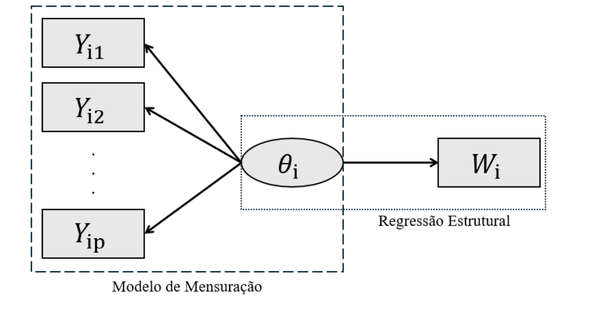

```{r configuracao, include=FALSE, eval=TRUE}
knitr::opts_chunk$set(
  echo = TRUE,
  eval = FALSE,
  warning = FALSE,
  message = FALSE,
  comment = NA,
  fig.align = "center",
  dpi = 150
)
options(width = 92, scipen = 999)
```

# Introdução {#introducao}

Diferentemente das variáveis de mensuração direta e explícita comumente utilizadas na ciência de dados, fenômenos complexos como habilidades e comportamentos constituem variáveis latentes, cuja natureza não observável implica inerente subjetividade e erro de medida. Originado nos estudos de [Spearman (1904)](#ref-spearman-1904) sobre a inteligência humana e fundamentando o desenvolvimento da Análise Fatorial, esse conceito define tais variáveis como construtos teóricos que, embora não passíveis de observação direta, podem ser estimados estatisticamente por meio de indicadores observados ([Bollen, 1989](#ref-bollen-1989)).

O tipo de método empregado para modelar variáveis latentes depende se o construto está na escala contínua, ou está dividido em classes latentes. Da mesma forma, a natureza dos indicadores, sejam eles contínuos ou categóricos, também influenciam na escolha do metodologia utilizada. Uma das abordagens utilizadas na literatura é a Teoria da Resposta ao Item (TRI), que modela a relação entre um traço latente na escala contínua e a probabilidade de um indivíduo obter um determinado resultado em um teste ([Hambleton et al., 1991](#ref-hambleton-1991)). Apesar do amplo uso da TRI no contexto psicométrico ou de avaliação educacional, a TRI possui um caráter multidisciplinar, podendo ser aplicadas nas mais diversas áreas do conhecimento ([Hays et al., 2007](#ref-hays-2007); [Knoll e Houts, 2012](#ref-knoll-2012); [Hare e Poole, 2018](#ref-hare-2018)).

Os modelos iniciais da TRI propostos por [Lord (1952)](#ref-lord-1952), [Rasch (1960)](#ref-rasch-1960) e [Birnbaum (1968)](#ref-birnbaum-1968) consideram itens dicotômicos, isto é, se um indivíduo respondeu corretamente a um item de um teste ou não. Posteriormente, [Samejima (1969)](#ref-samejima-1969) estendeu a abordagem dicotômica para itens politômicos com o Modelo de Respostas Graduais (GRM, do inglês. Graded Response Models), modelando a probabilidade de um indivíduo responder a uma determinada categoria ordinal de um teste. A partir disso, outras abordagens para respostas categóricas foram formuladas, como o Modelo para Respostas Nominais ([Bock, 1972](#ref-bock-1972)), Modelo da Escala Gradual ([Andrich, 1978](#ref-andrich-1978)) e o Modelo do Crédito Parcial ([Masters, 1982](#ref-masters-1982); [Muraki, 1992](#ref-muraki-1992)).

Não obstante, [Samejima (1973)](#ref-samejima-1973) observou uma necessidade de incorporação de respostas na escala contínua na estimação da variável latente pela TRI. Isso se deve ao fato de que, em testes psicométricos, respostas contínuas podem ser obtidas, de duas formas. A primeira é pela mensuração do tempo até a finalização de uma determinada atividade ([Roskam, 1997](#ref-roskam-1997); [Van der Linden, 2006](#ref-van-der-linden-2006); [Ferrando e Lorenzo-Seva, 2007](#ref-ferrando-2007)). A segunda forma é quando testes são respondidos utilizando escalas visuais analógicas em segmento de reta ([Cella e Perry, 1986](#ref-cella-1986); [Guyatt et al., 1987](#ref-guyatt-1987); [Ferrando, 2001](#ref-ferrando-2001)).

Existe uma terceira forma de se obter respostas contínuas normais para a mensuração de um traço latente, que é padronização de variáveis indicadoras contínuas utilizando o método do z-score. Neste caso, variáveis que são medidas em escalas distintas são postas em uma mesma escala para comparar quantos desvios padrão um valor específicos está acima ou abaixo da média. Esse tipo de abordagem é muito comum na construção de índices sintéticos ([OCDE, 2008](#ref-ocde-2008)), nos quais o uso da TRI é aplicável ([Filmer e Scott, 2012](#ref-filmer-2012); [Vandemoortele, 2014](#ref-vandemoortele-2014)).

Dessa forma, [Samejima (1973)](#ref-samejima-1973) formalizou o Modelo de Respostas Contínuas (CRM, do inglês, Continuous Response Model) para respostas limitadas ao intervalo 0 e 1 e usando a distribuição ogiva normal para modelar o traço latente. [Wang e Zeng (1998)](#ref-wang-1998) propuseram uma reparametrização do modelo de Samejima ao aplicar uma transformação logaritmica às respostas contínuas, ainda associado à distribuição normal. Para a estimação frequentista dos parâmetros dos itens no CRM, os autores desenvolveram uma abordagem por máxima verossimilhança marginal com o auxílio do algoritmo de Esperança-Maximização (EM) ([Dempster et al., 1977](#ref-dempster-1977)).

Em muitas aplicações, contudo, a estimação da variável latente não é o ponto final da análise. O traço estimado pode ser utilizado como variável explicativa em modelos de regressão para investigar sua associação com respostas observadas, denotadas por desfechos distais. [Schofield (2008)](#ref-schofield-2008) discute que escores de testes cognitivos, quando usados como preditores em modelos de regressão, carregam erro de mensuração que não deve ser ignorado. Não obstante, ao tratar uma variável latente estimada como se fosse observada sem erro, os coeficientes de regressão podem se tornar enviesados, com tendência de atenuação do efeito associado ao preditor medido com erro ([Junker et al., 2012](#ref-junker-2012); [Schofield et al., 2015](#ref-schofield-2015)).

A literatura sobre regressão com escores fatoriais e modelos de estrutura latente também aponta que procedimentos em etapas, nos quais escores latentes preditos são posteriormente tratados como observados, podem subestimar associações estruturais ([Skrondal e Laake, 2001](#ref-skrondal-2001); [Bolck et al., 2004](#ref-bolck-2004); [Devlieger et al., 2016](#ref-devlieger-2016)). Embora [Schofield (2008)](#ref-schofield-2008) tenha enfatizado aplicações em regressão linear, a própria formulação baseada em modelos de mensuração e modelos estruturais permite extensão para modelos lineares generalizados, incluindo modelos para respostas dicotômicas. Nesse contexto, abordagens bayesianas são particularmente úteis porque permitem estimar simultaneamente o modelo de mensuração e o modelo de regressão, propagando a incerteza da variável latente para a inferência sobre o desfecho distal ([Fox e Glas, 2003](#ref-fox-2003); [Junker et al., 2012](#ref-junker-2012)).

Considerando que, embora existam propostas para modelagem de respostas contínuas no contexto da TRI, essa linha de pesquisa permanece relativamente pouco explorada quando comparada ao vasto desenvolvimento dos modelos para dados categóricos. Além disso, o uso de modelos de equações simultâneas com análise fatorial confirmatória como modelo de mensuração é amplamente utilizado na literatura ([Kline, 1998](#ref-kline-1998)). Apesar disso, os modelos contínuos da TRI são perfeitamente comparáveis à análise fatorial ([Mellenbergh, 1994](#ref-mellenbergh-1994); [Ferrando, 2002](#ref-ferrando-2002)), oferecendo outras vantagens, como a interpretação de cada um dos itens com base em parâmetros de discriminação ou de dificuldade, bem como na avaliação do padrão de respostas dos indivíduos ([Ferrando, 1999](#ref-ferrando-1999), [2010](#ref-ferrando-2010)).

Ademais, existe uma predominância de abordagens de estimação frequentista na literatura, tanto para os modelos categóricos ([Hambleton et al., 1991](#ref-hambleton-1991)), quanto para os recentes desenvolvimentos dos modelos contínuos ([Tutz e Jordan, 2024](#ref-tutz-2024)). Em contrapartida, as formulações bayesianas oferecem maior flexibilidade para a modelagem da estrutura de mensuração, incorporação de incerteza e extensão a abordagens mais complexas ([Fox, 2010](#ref-fox-2010)).

Assim sendo, este trabalho tem como objetivo geral utilizar a variável latente estimada pela TRI utilizando itens contínuos como preditor em um modelo de regressão logística para um desfecho distal dicotômico. Especificamente, busca-se comparar uma abordagem em duas etapas, na qual primeiro se estima o CRM por máxima verossimilhança marginal com otimização via algoritmo EM e depois se trata a variável latente estimada como observada na regressão logística, com uma abordagem bayesiana de estimação conjunta da TRI e da regressão. Por meio de um estudo com dados simulados, pretende-se atestar se a estimação bayesiana conjunta corrige a subestimação do efeito da variável latente sobre a resposta distal quando comparada à abordagem em duas etapas.

# Metodologia {#metodologia}

O modelo proposto considera um único traço latente $\theta_i$, definido em escala contínua para cada indivíduo $i = 1, 2, \ldots, n$. Além disso, seja $Y_{ij}$ as variáveis indicadoras observadas com $j = 1, 2, \ldots, p$, também definidas na escala contínua. Neste contexto, é definido o modelo de mensuração do construto em que as variações dos indicadores são explicadas pela variação do traço latente ([Bollen, 1989](#ref-bollen-1989)).

Seja $W_i$ uma variável de desfecho observada, denotada por resposta distal, cujo preditor não é observado diretamente. Neste caso, é definida a regressão estrutural, em que $W_i$ é modelado condicionalmente a $\theta_i$. Dessa forma, o Modelo Estrutural apresentado na [Figura 1](#fig-modelo-estrutural) representa a combinação de um Modelo de Mensuração com a Regressão Estrutural [Kline (1998)](#ref-kline-1998).

<div id="fig-modelo-estrutural" class="figure-title">Figura 1: Representação por diagrama de caminhos de um Modelo Estrutural.</div>

```{r figura-1, echo=FALSE, eval=TRUE, out.width="92%"}

```

<div class="figure-source">Fonte: elaboração própria do autor.</div>

Em termos gerais, a estrutura apresentada permite avaliar em que medida diferenças individuais no traço latente afetam a também a variação de uma variável exógena observada diretamente.

## Teoria da Resposta ao Item para Respostas Contínuas {#tri-respostas-continuas}

O Modelo de Mensuração proposto definido pelo CRM o qual é baseado na formulação original de Samejima ([1973](#ref-samejima-1973), [1974](#ref-samejima-1974)). Considerando uma amostra de tamanho $n$ e um teste com $p$ itens, seja $Y_{ij}$ o escore observado do i-ésimo indivíduo no j-ésimo item, tal que $0 \leq Y_{ij} < k_j$, $\forall i = 1, 2, \ldots, n$, $j = 1, 2, \ldots, p$. Assim sendo, [Wang e Zeng (1998)](#ref-wang-1998) propuseram a seguinte transformação:

$$
Z_{ij}=\ln\left(\frac{Y_{ij}}{k_j-Y_{ij}}\right)
\Longleftrightarrow
Y_{ij}=\frac{k_j\exp\{Z_{ij}\}}{1+\exp\{Z_{ij}\}}. \tag{1}
$$

Aplicando a transformação apresentada na Equação (1) sobre a função de integração original de [Samejima (1973)](#ref-samejima-1973), a função densidade de probabilidade de $Z_{ij}$ é definida por:

$$
f_Z(z_{ij}\mid\theta_i,a_j,b_j,\alpha_j)=
\frac{a_j}{\sqrt{2\pi\alpha_j^2}}
\exp\left\{-\frac{\left[a_j\left(\theta_i-b_j-\frac{z_{ij}}{\alpha_j}\right)\right]^2}{2}\right\}. \tag{2}
$$

em que $\theta_i$ é o traço latente do i-ésimo indivíduo, $\theta_i \in \mathbb{R}$, $\forall i = 1, 2, \ldots, n$. $a_j$, $b_j$ e $\alpha_j$ são os parâmetros da TRI, representando respectivamente a discriminação, dificuldade e escala referentes ao j-ésimo item, tal que $a_j > 0$, $b_j \in \mathbb{R}$, $\alpha_j > 0$, $\forall j = 1, 2, \ldots, p$. Ao análisar a estrutura da Equação (2), é facil ver que $Z_{ij}\mid\theta_i,a_j,b_j,\alpha_j$ possui a seguinte distribuição de probabilidade:

$$
Z_{ij}\mid\theta_i,a_j,b_j,\alpha_j \sim
N\left(\alpha_j(\theta_i-b_j),\frac{\alpha_j^2}{a_j^2}\right). \tag{3}
$$

Para implementar o ajuste de qualquer modelo da TRI para a estimação de um único traço latente, faz-se necessário que o teste seja unidimensional, isto é, as respostas observadas precisam estar mensurando, em grande parte, uma única variável latente ([Fox, 2010](#ref-fox-2010)). Essa suposição pode ser verificada por uma análise de correlação entre as respostas dos itens dois a dois. O desejado é que as correlações sejam todas positivas e estatisticamente diferentes de zero.

Adicionalmente, as respostas aos itens precisam ser independentes quando condicionadas ao traço latente. Conforme visto por [Hambleton et al. (1991)](#ref-hambleton-1991), a unidimensionalidade implica independência local, portanto a verificação da primeira suposição já garante que a segunda também é verdadeira. Por fim, há uma terceira suposição de que o traço latente está distribuído seguindo uma distribuição Normal padrão. Apesar de estudos aplicados com a TRI se basearem nesta suposição, é possível ajustar modelos da TRI considerando distribuições não normais para o traço latente ([Zhang et al., 2021](#ref-zhang-2021)).

### Interpretação dos parâmetros {#interpretacao-parametros}

A interpretação dos parâmetros do CRM pode ser feita pelas curvas características acumuladas. Seguindo a formulação de [Samejima (1969)](#ref-samejima-1969) e sua extensão para respostas contínuas ([Samejima, 1973](#ref-samejima-1973)), para um ponto de corte $\lambda$, tal que $0 < \lambda < k_j$, define-se:

$$
z_{j\lambda}=\ln\left(\frac{\lambda}{k_j-\lambda}\right),
$$

e, a partir da reparametrização de [Wang e Zeng (1998)](#ref-wang-1998), a probabilidade acumulada de o indivíduo $i$ apresentar uma resposta no item $j$ igual ou superior a $\lambda$ é:

$$
P(Y_{ij}\geq\lambda\mid\theta_i)=
\Phi\left[a_j\left(\theta_i-b_j-
\frac{1}{\alpha_j}\ln\left(\frac{\lambda}{k_j-\lambda}\right)\right)\right].
$$

O parâmetro $a_j$ controla a inclinação das curvas e, portanto, a capacidade de discriminação do item. Valores elevados de $a_j$ produzem transições mais íngremes entre probabilidades baixas e altas, distinguindo com maior precisão indivíduos com níveis próximos de $\theta$. Valores reduzidos produzem curvas mais planas e respostas mais ruidosas em relação ao traço latente. No CRM normal, a informação fornecida pelo item é constante ao longo da escala e corresponde a:

$$
I_j(\theta)=a_j^2.
$$

Consequentemente, a informação total de um teste com $p$ itens é aditiva, de modo que:

$$
I(\theta)=\sum_{j=1}^{p}I_j(\theta)=\sum_{j=1}^{p}a_j^2.
$$

Assim, itens com maior discriminação fornecem mais informação e reduzem o erro-padrão associado à estimação do traço. A [Figura 2](#fig-crm-discriminacao) ilustra esse comportamento mantendo $b_j$ e $\alpha_j$ fixos.

```{r curvas-crm-funcoes, eval=TRUE}
# Pacotes --------------------------------------------------------------------
library(ggplot2)
library(dplyr)
library(patchwork)

# Modelo TRI contínua - CRM --------------------------------------------------
# No artigo, o parâmetro de escala é denotado por alpha.
#
# P(Y >= lambda | theta) = Phi[v]
#
# v = a * (theta - b - (1/alpha) * log(lambda/(k - lambda)))
#
# em que:
# a      = discriminação do item
# b      = dificuldade do item
# alpha  = parâmetro de escala do item
# k      = limite superior da escala contínua de resposta
# lambda = ponto de corte da escala de resposta, com 0 < lambda < k

crm_p_ge_lambda = function(theta, lambda, a, b, alpha, k){
  v = a * (theta - b - (1 / alpha) * log(lambda / (k - lambda)))
  pnorm(v)
}

# Sequência de habilidade ----------------------------------------------------
theta = seq(-8, 8, length.out = 500)

# Limite superior da escala contínua de resposta
# Exemplo: respostas variando de 0 a 5
k = 5

# Pontos de corte usados para desenhar as curvas cumulativas
# Como 0 < lambda < k, usamos lambda = 1, 2, 3, 4
lambda_values = 1:4

# Função para montar base de dados do CRM ------------------------------------
montar_dados_crm = function(theta, a_values, b_values, alpha_values,
                            k = 5, lambda_values = 1:4){

  stopifnot(length(a_values) == length(b_values))
  stopifnot(length(a_values) == length(alpha_values))
  stopifnot(all(lambda_values > 0))
  stopifnot(all(lambda_values < k))

  n_itens = length(a_values)

  dados_curvas = expand.grid(
    theta = theta,
    item = 1:n_itens,
    lambda = lambda_values
  ) %>%
    mutate(
      a = a_values[item],
      b = b_values[item],
      alpha = alpha_values[item],

      P_ge_lambda = crm_p_ge_lambda(
        theta = theta,
        lambda = lambda,
        a = a,
        b = b,
        alpha = alpha,
        k = k
      ),

      lambda_fator = factor(
        lambda,
        levels = lambda_values
      )
    )

  return(dados_curvas)
}

# Função para plotar cada item ------------------------------------------------
plot_item_crm = function(i, dados_curvas){

  df_prob = dados_curvas %>%
    filter(item == i)

  a_i = unique(df_prob$a)
  b_i = unique(df_prob$b)
  alpha_i = unique(df_prob$alpha)
  lambda_i = sort(unique(df_prob$lambda))

  ggplot(df_prob, aes(theta, P_ge_lambda, color = lambda_fator)) +

    geom_line(linewidth = 1) +

    coord_cartesian(ylim = c(0, 1)) +

    labs(
      title = bquote(
        "Item " ~ .(i) ~ ":  " ~
          a == .(a_i) ~ "   " ~
          b == .(b_i) ~ "   " ~
          alpha == .(alpha_i)
      ),
      x = expression(theta),
      y = expression(P(Y >= lambda ~ "|" ~ theta)),
      color = expression(lambda)
    ) +

    scale_color_viridis_d(
      option = "plasma",
      direction = -1,
      labels = parse(text = paste0("lambda == ", lambda_i))
    ) +

    theme_classic()
}

# Função para montar painel de itens -----------------------------------------
plot_cenario_crm = function(nome_cenario, a_values, b_values, alpha_values,
                            theta = theta, k = 5, lambda_values = 1:4){

  dados_curvas = montar_dados_crm(
    theta = theta,
    a_values = a_values,
    b_values = b_values,
    alpha_values = alpha_values,
    k = k,
    lambda_values = lambda_values
  )

  plots_itens = lapply(
    seq_along(a_values),
    function(i){
      plot_item_crm(i, dados_curvas)
    }
  )

  painel_itens = wrap_plots(
    plots_itens,
    ncol = 2,
    guides = "collect"
  ) +
    plot_annotation(
      title = nome_cenario
    ) &
    theme(
      legend.position = "right"
    )

  return(
    list(
      dados = dados_curvas,
      painel_itens = painel_itens
    )
  )
}
```

<div id="fig-crm-discriminacao" class="figure-title">Figura 2: Curvas características acumuladas do CRM para diferentes valores do parâmetro de discriminação $a_j$, mantendo $b_j=0$ e $\alpha_j=1$.</div>

```{r figura-2-discriminacao, eval=TRUE, fig.width=9.5, fig.height=7.2}
# =============================================================================
# 1) Exemplo variando as discriminações: parâmetro a
# =============================================================================
# Interpretação esperada:
# - Quanto maior a, mais íngremes são as curvas P(Y >= lambda | theta).
# - b e alpha são mantidos fixos.

a_values = c(0.5, 1.0, 1.8, 3.0)
b_values = c(0, 0, 0, 0)
alpha_values = c(1, 1, 1, 1)

cenario_a = plot_cenario_crm(
  nome_cenario = NULL,
  a_values = a_values,
  b_values = b_values,
  alpha_values = alpha_values,
  theta = theta,
  k = k,
  lambda_values = lambda_values
)

print(cenario_a$painel_itens)
```

<div class="figure-source">Fonte: elaboração própria do autor.</div>

O parâmetro $b_j$ determina a localização horizontal das curvas e representa o nível do traço latente exigido para que o indivíduo alcance uma mesma probabilidade acumulada. Conforme mostra a [Figura 3](#fig-crm-dificuldade), valores maiores deslocam todas as curvas do item para a direita, enquanto valores menores as deslocam para a esquerda. Como $b_j$ altera a localização, mas não a inclinação das curvas, ele não modifica $I_j(\theta)=a_j^2$.

<div id="fig-crm-dificuldade" class="figure-title">Figura 3: Curvas características acumuladas do CRM para diferentes valores do parâmetro de dificuldade $b_j$, mantendo $a_j=1{,}5$ e $\alpha_j=1$.</div>

```{r figura-3-dificuldade, eval=TRUE, fig.width=9.5, fig.height=7.2}
# =============================================================================
# 2) Exemplo variando as dificuldades: parâmetro b
# =============================================================================
# Interpretação esperada:
# - Quanto maior b, mais à direita ficam as curvas.
# - Itens com maior b exigem maior theta para atingir a mesma probabilidade
#   acumulada P(Y >= lambda | theta).
# - a e alpha são mantidos fixos.

a_values = c(1.5, 1.5, 1.5, 1.5)
b_values = c(-2.0, -0.5, 1.0, 2.5)
alpha_values = c(1, 1, 1, 1)

cenario_b = plot_cenario_crm(
  nome_cenario = NULL,
  a_values = a_values,
  b_values = b_values,
  alpha_values = alpha_values,
  theta = theta,
  k = k,
  lambda_values = lambda_values
)

print(cenario_b$painel_itens)
```

<div class="figure-source">Fonte: elaboração própria do autor.</div>

O parâmetro $\alpha_j$ controla a escala da transformação entre a resposta observada e o traço latente. Na distribuição da Equação (3), a variância condicional é $\alpha_j^2/a_j^2$; nas curvas acumuladas, $\alpha_j$ também regula a distância horizontal entre os pontos de corte. Valores menores ampliam o espaçamento entre as curvas associadas aos diferentes valores de $\lambda$, enquanto valores maiores aproximam essas curvas. A [Figura 4](#fig-crm-escala) evidencia que esse parâmetro afeta a forma como a escala contínua de respostas é discretizada em níveis acumulados.

<div id="fig-crm-escala" class="figure-title">Figura 4: Curvas características acumuladas do CRM para diferentes valores do parâmetro de escala $\alpha_j$, mantendo $a_j=1{,}5$ e $b_j=0$.</div>

```{r figura-4-escala, eval=TRUE, fig.width=9.5, fig.height=7.2}
# =============================================================================
# 3) Exemplo variando as escalas: parâmetro alpha
# =============================================================================
# Interpretação esperada:
# - O parâmetro alpha controla a transformação entre a escala original de
#   resposta Y e a escala latente theta.
# - Valores menores de alpha aumentam a distância horizontal entre as curvas
#   P(Y >= lambda | theta) associadas aos diferentes pontos de corte lambda.
# - Valores maiores de alpha aproximam essas curvas.
# - a e b são mantidos fixos.

a_values = c(1.5, 1.5, 1.5, 1.5)
b_values = c(0, 0, 0, 0)
alpha_values = c(0.5, 0.8, 1.5, 3.0)

cenario_alpha = plot_cenario_crm(
  nome_cenario = NULL,
  a_values = a_values,
  b_values = b_values,
  alpha_values = alpha_values,
  theta = theta,
  k = k,
  lambda_values = lambda_values
)

print(cenario_alpha$painel_itens)
```

<div class="figure-source">Fonte: elaboração própria do autor.</div>

Os parâmetros $a_j$ e $\alpha_j$ atuam conjuntamente no formato das curvas. O primeiro controla principalmente a inclinação e a informação do item, enquanto o segundo controla o espaçamento entre os limiares transformados. Assim, itens com a mesma localização podem apresentar combinações muito distintas de precisão e separação entre níveis de resposta. A [Figura 5](#fig-crm-discriminacao-escala) reúne quatro combinações e permite observar essa interação.

<div id="fig-crm-discriminacao-escala" class="figure-title">Figura 5: Curvas características acumuladas do CRM para diferentes combinações dos parâmetros de discriminação $a_j$ e escala $\alpha_j$, mantendo $b_j=0$.</div>

```{r figura-5-discriminacao-escala, eval=TRUE, fig.width=9.5, fig.height=7.2}
# =============================================================================
# 4) Exemplo adicional: parâmetros semelhantes aos itens hipotéticos do artigo
# =============================================================================
# O artigo ilustra itens com diferentes valores de a, b e alpha.

a_values = c(1.0, 0.2, 0.2, 2.5)
b_values = c(0.0, 0.0, 0.0, 0.0)
alpha_values = c(1.0, 0.2, 2.5, 0.2)

cenario_artigo = plot_cenario_crm(
  nome_cenario = NULL,
  a_values = a_values,
  b_values = b_values,
  alpha_values = alpha_values,
  theta = theta,
  k = k,
  lambda_values = lambda_values
)

print(cenario_artigo$painel_itens)
```

<div class="figure-source">Fonte: elaboração própria do autor.</div>

## Regressão Logística {#regressao-logistica}

A Regressão Logística não modela diretamente o desfecho, mas sim a probabilidade condicional de que a variável resposta assuma o valor 1 (sucesso) dado um conjunto de preditores ([Cox e Hinkley, 1979](#ref-cox-1979)). Seja $W_i$ a resposta distal binária para o i-ésimo indivíduo (i.e., $W_i \in \{0,1\}$, $\forall i = 1, 2, \cdots, n$), a Equação (4) descreve a função logito, a qual lineariza a relação entre um preditor observado $X$ e o desfecho binário:

$$
\eta_i=\ln\left[\frac{P(W_i=1\mid X_i)}{1-P(W_i=1\mid X_i)}\right]
=\beta_0+\beta_1X_i. \tag{4}
$$

Da mesma forma, define-se $q_i$ como:

$$
q_i=\frac{1}{1+\exp[-(\beta_0+\beta_1X_i)]}. \tag{5}
$$

Como $q_i$ é uma probabilidade (i.e., $0 \geq q_i > 1$, $\forall i = 1, 2, \ldots, n$), então a distribuição de $W_i\mid X_i,\beta_0,\beta_1$ é dada como:

$$
W_i\mid X_i,\beta_0,\beta_1 \sim \operatorname{Bern}(q_i). \tag{6}
$$

## Métodos de Estimação {#metodos-estimacao}

Considerando o CRM como modelo de mensuração e a regressão logística como a regressão estrutural, o processo de estimação deve ser capaz de estimar o modelo que esteja de acordo com a estrutura apresentada na [Figura 1](#fig-modelo-estrutural). Para tanto, serão comparadas a abordagem de estimação em duas etapas, e a estimação simultânea da TRI e da regressão.

### Estimação em Duas Etapas {#estimacao-duas-etapas}

Na estimação em duas etapas, o CRM é ajustado primeiro às respostas contínuas transformadas. A independência condicional dos itens permite combinar suas contribuições individuais e integrar o traço latente, assumido usualmente como normal padrão, para obter a verossimilhança marginal dos parâmetros de discriminação, dificuldade e escala ([Zhang et al., 2021](#ref-zhang-2021)). Como essa integração dificulta a maximização direta, o algoritmo de Esperança-Maximização trata o traço como dado não observado: no passo de esperança, calcula as quantidades condicionais necessárias sob os parâmetros correntes; no passo de maximização, atualiza os parâmetros dos itens. O detalhamento algébrico e as regras de atualização são apresentados por [Wang e Zeng (1998)](#ref-wang-1998).

A calibração estima primeiro os parâmetros de todos os itens e, em seguida, os traços individuais condicionados a essa calibração. Para reduzir o custo computacional de cada ciclo, [Shojima (2005)](#ref-shojima-2005) propôs uma solução não iterativa no CRM normal, com formas explícitas no passo de esperança e soluções fechadas no passo de maximização sob prioris vagas. Essa abordagem está implementada no pacote EstCRM no R ([Zopluoglu, 2012](#ref-zopluoglu-2012)). Foi considerado o limiar de $10^{-4}$ como critério de convergência, com limite máximo de 1000 iterações por ciclo EM.

Na segunda etapa, os traços estimados são inseridos como preditores em uma regressão logística convencional. Os coeficientes são obtidos por máxima verossimilhança e, como o problema não possui solução analítica fechada, a função `glm()` do R emprega mínimos quadrados iterativamente reponderados. A cada iteração, o procedimento atualiza o preditor linear e as probabilidades, constrói uma resposta pseudo-observada e pesos dependentes das probabilidades correntes e resolve um problema de mínimos quadrados ponderados; as atualizações continuam até a estabilização dos parâmetros ou da log-verossimilhança ([Maalouf, 2011](#ref-maalouf-2011)).

Esse procedimento é direto, mas trata cada escore latente estimado como se fosse observado sem erro. [Schofield (2008)](#ref-schofield-2008) mostra que a incerteza de mensuração que acompanha o traço não é incorporada à regressão e pode produzir atenuação do coeficiente associado ao preditor latente. Em outras palavras, quanto maior o erro de mensuração, maior pode ser a subestimação do efeito estrutural ([Junker et al., 2012](#ref-junker-2012); [Schofield et al., 2015](#ref-schofield-2015)). A literatura de regressão com escores fatoriais documenta comportamento semelhante quando os escores previstos são usados como covariáveis sem correção ([Skrondal e Laake, 2001](#ref-skrondal-2001); [Bolck et al., 2004](#ref-bolck-2004); [Devlieger et al., 2016](#ref-devlieger-2016)).

### Estimação Simultânea {#estimacao-simultanea}

Na estimação simultânea, o CRM e a regressão logística formam um único modelo hierárquico. As respostas transformadas informam os parâmetros dos itens e os traços individuais, enquanto o desfecho binário é condicionado diretamente ao mesmo traço latente. Assim, a incerteza sobre cada $\theta_i$ é propagada para a estimação dos coeficientes da regressão, em vez de ser descartada entre duas etapas ([Fox e Glas, 2003](#ref-fox-2003); [Junker et al., 2012](#ref-junker-2012)).

A inferência é bayesiana: a distribuição posterior conjunta condicionada aos dados observados combina a verossimilhança do modelo de mensuração, a verossimilhança do desfecho e as distribuições a priori ([Dempster, 1968](#ref-dempster-1968)). Foram utilizadas prioris normais vagas para os parâmetros dos itens e para os coeficientes da regressão, com truncamento positivo para discriminação e escala, e uma priori normal padrão para o traço latente. A formulação segue a perspectiva de estimação de modelos da TRI por simulação bayesiana discutida por [Fox (2010)](#ref-fox-2010), [Kim e Bolt (2007)](#ref-kim-2007) e [Patz e Junker (1999)](#ref-patz-1999).

Como a distribuição posterior não possui forma analítica simples, a amostragem é feita por Métodos de Monte Carlo via Cadeias de Markov. O JAGS implementa atualizações condicionais e, quando necessário, mecanismos do tipo Metropolis-Hastings, construindo cadeias cuja distribuição estacionária é a posterior de interesse ([Metropolis et al., 1953](#ref-metropolis-1953); [Hastings, 1970](#ref-hastings-1970); [Jackman, 2000](#ref-jackman-2000); [Plummer, 2017](#ref-plummer-2017)). A implementação utiliza a interface rjags ([Plummer et al., 2025](#ref-plummer-2025)), e os diagnósticos e resumos das cadeias são apoiados pelo pacote coda ([Plummer et al., 2006](#ref-plummer-2006)).

## Estudo com Dados Simulados {#estudo-dados-simulados}

Para avaliar o comportamento dos métodos, foram geradas 1000 replicações para cada combinação de tamanho amostral $n \in \{100,250,500,1000\}$ e quantidade de itens $p \in \{10,20\}$. Os parâmetros verdadeiros da regressão logística foram fixados em $\beta_0=0{,}2$ e $\beta_1=1{,}5$. A exposição detalhada a seguir usa o cenário $n=1000$ e $p=10$, presente nos arquivos R das abordagens `Classic` e `Joint`, como exemplo comum às duas aplicações. Os blocos de maior custo são exibidos para documentar integralmente o procedimento, mas não são executados na produção deste relatório; tabelas e figuras são reconstruídas apenas a partir dos resultados já salvos.

### Sementes, dimensões e parâmetros verdadeiros {#sementes-parametros}

O primeiro bloco fixa 1000 replicações, define os quatro tamanhos de amostra e as duas quantidades de itens e seleciona a quarta posição de `n_values` e a primeira de `p_values`. As sementes dependem de cada dimensão, de modo que a geração dos traços e dos parâmetros dos itens possa ser reproduzida. Os traços seguem normal padrão; discriminação e escala são sorteadas uniformemente entre 0,30 e 2,50, e dificuldade segue normal padrão.

```{r parametros-verdadeiros}
r = 1000
n_values = c(100, 250, 500, 1000)
p_values = c(10, 20)

thetas_reais = list()
for (i in 1:length(n_values)) {
  set.seed(228371 + n_values[i])
  theta = rnorm(n_values[i], mean = 0, sd = 1)
  thetas_reais[[as.character(n_values[i])]] = theta
}

param_itens_reais = list()
for (j in 1:length(p_values)) {
  set.seed(448291 + p_values[j])
  param.itens = matrix(NA, p_values[j], 3)
  colnames(param.itens) = c("a", "b", "alpha")
  param.itens[, 1] = runif(p_values[j], min = 0.30, max = 2.50)
  param.itens[, 2] = rnorm(p_values[j], mean = 0, sd = 1)
  param.itens[, 3] = runif(p_values[j], min = 0.30, max = 2.50)
  param_itens_reais[[as.character(p_values[j])]] = param.itens
}

n = n_values[4]
p = p_values[1]
k = 1
theta = thetas_reais[[as.character(n)]]
param = param_itens_reais[[as.character(p)]]
a = param[, 1]
b = param[, 2]
alpha = param[, 3]
```

### Geração do traço, dos itens CRM e do desfecho {#geracao-dados}

Para cada replicação, os parâmetros vetoriais são expandidos em matrizes $n\times p$. A média condicional de cada resposta transformada é `alpha * (theta - b)` e seu desvio padrão é `alpha / a`, exatamente como na Equação (3). Depois de gerar `Z`, a transformação logística inversa produz as respostas contínuas `Y` no intervalo $(0,1)$. As linhas de gravação aparecem comentadas nos arquivos originais; por isso, este relatório não regrava nem substitui os dados simulados existentes.

```{r geracao-crm}
Z = matrix(NA, n, p)
Y = matrix(NA, n, p)

for (m in 1:r) {
  set.seed(229182 + m)
  theta_mat = matrix(theta, n, p)
  b_mat = matrix(b, n, p, byrow = TRUE)
  a_mat = matrix(a, n, p, byrow = TRUE)
  alpha_mat = matrix(alpha, n, p, byrow = TRUE)

  mu = alpha_mat * (theta_mat - b_mat)
  sd = alpha_mat / a_mat
  Z = matrix(rnorm(n * p, mean = as.vector(mu),
                   sd = as.vector(sd)), n, p)
  Y = k * exp(Z) / (1 + exp(Z))
  resultados = Y
}
```

O desfecho distal usa o mesmo traço verdadeiro como preditor. O logito é calculado com os valores fixados de $\beta_0$ e $\beta_1$, convertido em probabilidade e usado na geração de uma resposta de Bernoulli para cada indivíduo e replicação. A semente muda com `m`, mantendo replicações distintas e reprodutíveis.

```{r geracao-desfecho}
beta_0 = 0.2
beta_1 = 1.5
x = thetas_reais[[4]]
logito = beta_0 + beta_1 * x
q = 1 / (1 + exp(-logito))

data.logistico = list()
for (m in 1:r) {
  set.seed(22913 + m)
  w = simcausal::rbern(n, q)
  data.logistico[[as.character(m)]] = w
}
```

### Estimação em duas etapas {#aplicacao-duas-etapas}

Na primeira etapa, cada matriz de respostas contínuas é fornecida a `EstCRMitem`. O argumento `type="Shojima"` seleciona a atualização proposta por Shojima, `BFGS=TRUE` habilita a otimização numérica complementar, `converge=0.0001` define a tolerância e `max.EMCycle=1000` impõe o limite de ciclos. Os parâmetros estimados são guardados por item e replicação. Em seguida, `EstCRMperson` calcula os escores individuais condicionados à calibração, sendo utilizada a segunda coluna de `fit_theta$thetas`.

```{r estimacao-em}
theta_estimados_EM = matrix(0, n, r)
a_estimados_EM = matrix(0, p, r)
b_estimados_EM = matrix(0, p, r)
alpha_estimados_EM = matrix(0, p, r)

for (m in 1:r) {
  Y = as.data.frame(read.table(
    file.path(Dados.dir.TRI, paste0("DadosTRI_", m, ".txt"))))

  fit_TRI = EstCRM::EstCRMitem(
    Y, max.item = rep(k, p), min.item = rep(0, p),
    max.EMCycle = 1000, converge = 0.0001,
    type = "Shojima", BFGS = TRUE
  )

  a_estimados_EM[, m] = fit_TRI$param[, 1]
  b_estimados_EM[, m] = fit_TRI$param[, 2]
  alpha_estimados_EM[, m] = fit_TRI$param[, 3]

  fit_theta = EstCRM::EstCRMperson(
    Y, ipar = as.matrix(fit_TRI$param),
    max.item = rep(k, p), min.item = rep(0, p)
  )
  theta_estimados_EM[, m] = fit_theta$thetas[, 2]
}
```

Na segunda etapa, o desfecho de cada replicação é associado ao respectivo vetor de escores estimados por uma regressão binomial com ligação logito. O intercepto e o coeficiente de `theta_hat` são armazenados para a avaliação empírica posterior.

```{r regressao-duas-etapas}
beta_0_estimados_EM = rep(0, r)
beta_1_estimados_EM = rep(0, r)

for (m in 1:r) {
  W = read.table(file.path(
    Dados.dir.Reg, paste0("Dados reg.log.", m, ".txt")))$V1
  theta_hat = theta_estimados_EM[, m]
  fit_logit = glm(W ~ theta_hat,
                  family = binomial(link = "logit"))
  beta_0_estimados_EM[m] = coef(fit_logit)[1]
  beta_1_estimados_EM[m] = coef(fit_logit)[2]
}
```

### Estimação simultânea {#aplicacao-simultanea}

O modelo JAGS reproduz a distribuição normal do CRM para `Z`, associa `W` diretamente ao traço latente por uma regressão logística e atribui uma normal padrão a cada `theta`. As prioris de `a` e `alpha` são normais truncadas em zero; as de `b`, `beta_0` e `beta_1` são normais vagas. Os valores iniciais são iguais nas três cadeias no código original: discriminações e escalas começam em 1, e os demais parâmetros em zero.

```{r especificacao-jags}
modelo = "
model {
  for (i in 1:n) {
    for (j in 1:p) {
      Z[i, j] ~ dnorm(alpha[j]*(theta[i] - b[j]), tau[i, j])
      tau[i, j] <- pow(alpha[j]/a[j], -2)
    }
    W[i] ~ dbin((ilogit(beta_0 + beta_1*theta[i])), 1)
    theta[i] ~ dnorm(0.0, 1.0)
  }
  for (j in 1:p) {
    a[j] ~ dnorm(1.0, 0.001) T(0, )
    b[j] ~ dnorm(0.0, 0.001)
    alpha[j] ~ dnorm(1.0, 0.001) T(0, )
  }
  beta_0 ~ dnorm(0.0, 1.0E-06)
  beta_1 ~ dnorm(0.0, 1.0E-06)
}
"

writeLines(modelo, con = "modelsimCRMreglognormal.txt")
jags.inits = function(chain) {
  list(a = rep(1, p), b = rep(0, p), alpha = rep(1, p),
       theta = rep(0, n), beta_0 = 0, beta_1 = 0)
}
params.jags = c("a", "b", "alpha", "theta", "beta_0", "beta_1")
nchains = 3
```

Em cada replicação, `Y` é reconvertido a `Z`, formando com `W`, `n` e `p` a lista de dados. O JAGS executa 2000 iterações de adaptação, descarta outras 2000 como burn-in e retém 4000 por cadeia, sem desbaste. As cadeias são reunidas em matriz; a média posterior de cada parâmetro fornece a estimativa pontual salva para aquela replicação.

```{r amostragem-jags}
for (m in 1:r) {
  set.seed(99829 + m)
  Y = read.table(file.path(
    Dados.dir.TRI, paste0("DadosTRI_", m, ".txt")))
  Z = log(Y / (k - Y))
  W = read.table(file.path(
    Dados.dir.Reg, paste0("Dados reg.log.", m, ".txt")))$V1
  data_list = list(Z = Z, W = W, n = n, p = p)

  modelo_jags = rjags::jags.model(
    file = "modelsimCRMreglognormal.txt",
    data = data_list,
    inits = function() jags.inits(chain = 1:nchains),
    n.chains = nchains, n.adapt = 2000
  )
  update(modelo_jags, n.iter = 2000)
  amostras = coda::coda.samples(
    model = modelo_jags, variable.names = params.jags,
    n.iter = 4000, thin = 1
  )

  sims_list = as.matrix(amostras)
  theta_estimados_mean[, m] = apply(
    sims_list[, grep("^theta", colnames(sims_list))], 2, mean)
  a_estimados_mean[, m] = apply(
    sims_list[, grep("^a\\[", colnames(sims_list))], 2, mean)
  b_estimados_mean[, m] = apply(
    sims_list[, grep("^b\\[", colnames(sims_list))], 2, mean)
  alpha_estimados_mean[, m] = apply(
    sims_list[, grep("^alpha\\[", colnames(sims_list))], 2, mean)
  beta_0_estimados_mean[m] = mean(sims_list[, "beta_0"])
  beta_1_estimados_mean[m] = mean(sims_list[, "beta_1"])
}
```

### Verificação do ajuste e medidas de desempenho {#verificacao-ajuste}

O código verifica visualmente a mistura e a estabilidade de $\beta_1$ por meio do gráfico de traço e compara as densidades entre cadeias. Em uma execução de produção, essa leitura deve ser complementada por estatísticas de convergência e tamanho efetivo de amostra para todos os parâmetros relevantes. No arquivo original, `amostras` é sobrescrito a cada passagem do laço; consequentemente, os dois gráficos abaixo se referem somente à última replicação processada.

```{r diagnostico-cadeias}
amostras_jags = as.mcmc.list(amostras)
traceplot(amostras[, "beta_1"])
bayesplot::mcmc_dens(amostras_jags, pars = "beta_1")
```

Para cada parâmetro, o vício é a diferença entre a média das 1000 estimativas e o valor verdadeiro. O RMSE agrega a raiz da média dos erros quadráticos entre replicações. A mesma lógica é usada para os traços individuais e para `a`, `b` e `alpha`; os resumos apresentados na seção seguinte foram calculados a partir dos resultados salvos.

```{r vies-rmse}
theta.est.medio = apply(theta_estimados_EM, 1, mean)
Vicio_theta = theta.est.medio - thetas_reais[[4]]

EQM_theta = matrix(0, r, n)
for (m in 1:r) {
  for (i in 1:n) {
    EQM_theta[m, i] =
      (theta_estimados_EM[i, m] - thetas_reais[[4]][i])^2
  }
}
RMSE_theta = sqrt(colMeans(EQM_theta))

Vicio_a = rowMeans(a_estimados_EM) - param_itens_reais[[1]][, 1]
Vicio_b = rowMeans(b_estimados_EM) - param_itens_reais[[1]][, 2]
Vicio_alpha = rowMeans(alpha_estimados_EM) - param_itens_reais[[1]][, 3]
RMSE_a = sqrt(rowMeans((a_estimados_EM - param_itens_reais[[1]][, 1])^2))
RMSE_b = sqrt(rowMeans((b_estimados_EM - param_itens_reais[[1]][, 2])^2))
RMSE_alpha = sqrt(rowMeans(
  (alpha_estimados_EM - param_itens_reais[[1]][, 3])^2))
```

# Resultados Numéricos {#resultados-numericos}

A avaliação numérica teve como finalidade, a comparação do desempenho da estimação frequentista em duas etapas e da estimação bayesiana conjunta conforme discutido na seção 2. A [Figura 6](#fig-estimativas-beta1) indica um comportamento distinto entre os dois métodos ao longo dos cenários amostrais.

<div id="fig-estimativas-beta1" class="figure-title">Figura 6: Comparação das estimativas de $\beta_1$ em relação ao valor verdadeiro (linha tracejada) para cada cenário simulado testado.</div>

```{r figura-6, echo=FALSE, eval=TRUE, fig.width=9.4, fig.height=5.8}
library(ggplot2)
beta_resultados = read.csv("dados/beta_1_estimativas.csv",
                           check.names = FALSE)
beta_resultados$n = factor(beta_resultados$n,
                           levels = c(100, 250, 500, 1000))
beta_resultados$metodo = factor(
  beta_resultados$metodo,
  levels = c("Duas etapas", "Conjunto")
)

ggplot(beta_resultados,
       aes(x = n, y = beta_1, fill = metodo)) +
  geom_boxplot(width = 0.66, outlier.size = 0.45,
               position = position_dodge(width = 0.75)) +
  geom_hline(yintercept = 1.5, linetype = "dashed",
             linewidth = 0.7) +
  scale_fill_manual(values = c("#ef8a62", "#67c5c2")) +
  labs(x = "Tamanho amostral (n)",
       y = expression(hat(beta)[1]), fill = "Método") +
  theme_bw(base_size = 13) +
  theme(legend.position = "top",
        panel.grid.minor = element_blank())
```

<div class="figure-source">Fonte: elaboração própria do autor.</div>

Em tamanhos amostrais menores ($n = 100$ e $n = 250$), a estimação bayesiana conjunta apresenta maior dispersão e tende a superestimar $\beta_1$. Esse resultado sugere que, em pequenas amostras, a estimação simultânea dos parâmetros dos itens, dos traços latentes individuais e dos parâmetros da regressão pode produzir instabilidade adicional. Como o modelo conjunto propaga a incerteza de $\theta$ diretamente para a regressão estrutural, a estimação de $\beta_1$ passa a depender fortemente da identificação conjunta da escala latente, dos parâmetros dos itens e da relação com o desfecho.

Curiosamente, para esses mesmos tamanhos amostrais, as estimativas de $\beta_1$ pelo método de estimação em duas etapas se concentram mais em torno do valor verdadeiro quando comparadas ao método conjunto. Em contrapartida, à medida que o tamanho amostral aumenta ($n = 500$ e $n = 1000$), é observada a tendência de subestimação do efeito do traço latente sobre a resposta distal a qual foi apontada na seção 1.

Por outro lado, para amostras maiores ($n = 500$ e $n = 1000$), nota-se uma melhora expressiva no comportamento da estimação conjunta, cujas estimativas de $\beta_1$ se concentram mais próximas do valor verdadeiro com redução clara da dispersão entre as replicações. Esse padrão é compatível com a expectativa de que a estimação simultânea se beneficie do aumento de informação amostral, pois amostras maiores fornecem mais evidência tanto para a identificação do traço latente quanto para a estimação da associação estrutural entre $\theta$ e $W$.

Além disso, a [Tabela 1](#tab-parametros-itens) avalia a qualidade dos estimadores dos parâmetros dos itens em ambos os métodos testados no estudo com dados simulados.

A análise dos resultados da [Tabela 1](#tab-parametros-itens) conclui que não houve mudanças substanciais no vício ou RMSE das estimativas dos parâmetros dos itens quando ambos os métodos são comparados. Essa é uma conclusão importante, visto que a permite inferir que a estimação simultânea do CRM e da regressão não afeta a estimação dos parâmetros dos itens. Desse modo, permanece-se preservada uma das grandes vantagens de se usar a TRI, que é a interpretação de cada um dos itens de um teste através de seus parâmetros de discriminação, dificuldade ou de escala.

<div id="tab-parametros-itens" class="table-title">Tabela 1: Comparação entre os métodos de estimação em duas etapas e conjunto para os parâmetros dos itens no CRM.</div>

```{r tabela-1, echo=FALSE, eval=TRUE, results='asis'}
tabela = read.csv("dados/tabela_parametros.csv",
                  check.names = FALSE)
cat('<table class="table table-condensed">')
cat('<thead>')
cat('<tr><th rowspan="2">n</th><th rowspan="2">Método</th>',
    '<th colspan="3">Vicio</th><th colspan="3">RMSE</th></tr>')
cat('<tr><th>$\\widehat{a}$</th><th>$\\widehat{b}$</th>',
    '<th>$\\widehat{\\alpha}$</th><th>$\\widehat{a}$</th>',
    '<th>$\\widehat{b}$</th><th>$\\widehat{\\alpha}$</th></tr>')
cat('</thead><tbody>')
for (i in seq_len(nrow(tabela))) {
  valores = formatC(as.numeric(tabela[i, 3:8]), format = "f", digits = 4)
  cat('<tr><td>', tabela$n[i], '</td><td>', tabela$metodo[i], '</td>',
      paste0('<td>', valores, '</td>', collapse = ''), '</tr>', sep = '')
}
cat('</tbody></table>')
```

<div class="figure-source">Fonte: elaboração própria do autor.</div>

Outro ponto importante da análise é a estimação do traço latente para todos os $n$ indivíduos, haja vista que o traço latente é o preditor da regressão logística e, portanto, imprescindível para explicar o comportamento de $\widehat{\beta}_1$ observado na [Figura 6](#fig-estimativas-beta1).

<div id="fig-estimativas-theta" class="figure-title">Figura 7: Comparação das estimativas médias dos $\theta_i$ em relação ao seu respectivo valor verdadeiro para cada cenário simulado testado.</div>

```{r figura-7, echo=FALSE, eval=TRUE, fig.width=9.5, fig.height=7.2}
theta_resultados = read.csv("dados/theta_medias.csv",
                            check.names = FALSE)
theta_resultados$n = factor(theta_resultados$n,
                            levels = c(100, 250, 500, 1000))
theta_resultados$metodo = factor(
  theta_resultados$metodo,
  levels = c("Duas etapas", "Conjunto")
)

ggplot(theta_resultados,
       aes(x = theta_verdadeiro, y = theta_estimado_medio)) +
  geom_abline(intercept = 0, slope = 1, linetype = "dashed",
              linewidth = 0.55) +
  geom_point(color = "#24a7b5", alpha = 0.58, size = 0.7) +
  facet_grid(metodo ~ n) +
  coord_equal() +
  labs(x = expression(theta[i]),
       y = expression(bar(hat(theta))[i])) +
  theme_bw(base_size = 12) +
  theme(panel.grid.minor = element_blank(),
        strip.background = element_rect(fill = "#eaf0f5"))
```

<div class="figure-source">Fonte: elaboração própria do autor.</div>

A [Figura 7](#fig-estimativas-theta) mostra que, em todos os cenários, a média dos $\widehat{\theta}_i$ se alinha de forma bastante próxima aos respectivos valores verdadeiros. A nuvem de pontos acompanha a reta de identidade, sugerindo que tanto o método em duas etapas quanto o método conjunto preservam bem a ordenação dos indivíduos no traço latente. Em contrapartida, a principal diferença entre os métodos não está na média, mas na dispersão. No método em duas etapas, o desvio-padrão dos $\widehat{\theta}_i$ fica praticamente igual a 1 em todos os tamanhos amostrais simulados. No entanto, os desvios-padrão são menores: 0.918, 0.957, 0.968 e 0.974, respectivamente. Isso sugere uma contração dos $\widehat{\theta}_i$ no método conjunto, isto é, os valores estimados tendem a ficar um pouco mais concentrados em torno de zero.

Em se tratando de como a estimação do traço latente afeta o comportamento de $\widehat{\beta}_1$, nos cenários menores, especialmente $n = 100$ e $n = 250$, o método conjunto apresentou maior dispersão e tendência de superestimação de $\beta_1$. Isso pode estar relacionado ao fato de que, nesses cenários, os thetas estimados pelo método conjunto estão mais comprimidos em relação à escala verdadeira. Quando a variável latente usada na regressão tem menor variabilidade, o coeficiente associado a ela pode aumentar para representar a mesma relação com o desfecho, contribuindo para estimativas maiores de $\beta_1$. Adicionalmente, em pequenas amostras, a estimação simultânea da variável latente, parâmetros dos itens e parâmetros da regressão adiciona instabilidade, o que se reflete na maior dispersão dos boxplots.

# Conclusão e Trabalhos Futuros {#conclusao-trabalhos-futuros}

Os resultados apresentados na seção 3 demonstram que, de fato, tratar uma variável latente como observada incorre na subestimação de seu efeito sobre uma outra variável mensurada diretamente. Isso pode ser verificado na análise da [Figura 6](#fig-estimativas-beta1), sobretudo em tamanhos amostrais maiores. Como solução, a estimação conjunta da TRI e da regressão parece atenuar o problema do viés de $\widehat{\beta}_1$, principalmente considerando amostras grandes. Além disso, conforme visto na [Tabela 1](#tab-parametros-itens), não existe prejuízo significativo da estimação dos parâmetros dos itens no método de estimação conjunta quando comparado ã estimação em duas etapas. Desse modo, pode-se dizer que assintoticamente o método de estimação conjunta apresenta propriedades satisfatórias e tende a ser melhor que a estimação em duas etapas.

Entretanto, alguns problemas ainda precisam ser estudados em relação ao método de estimação conjunta. Em primeiro lugar, essa abordagem é mais instável na estimação de $\beta_1$ quando o tamanho amostral é menor, inclusive, apontando o método de estimação em duas etapas como mais estável e menos viesado. Em segundo, a estimação conjunta pelo método bayesiano ligeiramente subestima a dispersão dos $\theta_i$, principalmente em tamanhos amostrais menores. Isso pode ser um fator que explica superestimação excessiva de $\beta_1$ pelo método conjunto em pequenas amostras. Portanto, há de se estudar melhorias para a estimação simultânea, sobretudo em pequenas amostras.

Uma possível solução é adotar um sistema de prioris hieráquicas para o CRM, conforme já testado em outros modelos da TRI ([Kim e Bolt, 2007](#ref-kim-2007); [Natesan et al., 2016](#ref-natesan-2016)). Ao adotar prioris para os hiperparâmetros de média e precisão do traço latente e dos parâmetros dos itens pode ser interessante para corrigir o problema de subestimação ou superestimação de $\theta_i$ extremos. Dessa forma, isso pode diminuir a instabilidade da estimação de $\beta_1$ na estimação simultânea, podendo produzir resultados similares, ou até melhores, que a estimação em duas etapas.

Outro aspecto a ser observado é se a magnitude do viés de $\widehat{\beta}_1$ é alterada de acordo com o valor de $\beta_1$. Ou seja, se o traço latente possui um efeito maior sobre a resposta distal, pode ser que as estimativas desse efeito no método conjunto pode ficar mais instável à medida que o valor verdadeiro de $\beta_1$ seja maior. Da mesma forma, pode ser que a subestimação de $\beta_1$ também seja de maior magnitude quando se estima o modelo em duas etapas considerando $\beta_1$ maiores.

Por conseguinte, como trabalhos futuros a serem propostos estão a estimação conjunta do CRM e da regressão utilizando outros sistemas de prioris, sobretudo prioris hierárquicas e com diferentes valores de $\beta_1$. Há de se destacar também a importância de se utilizar ferramentas estatísticas mais recentes e com um poder computacional melhor, como é o caso do stan ([Gabry et al., 2025](#ref-gabry-2025)). Outras questões podem ser consideradas futuramente como presença de dados ausentes, $\theta$ de distribuições não normais, presença de covariáveis na TRI, dentre outros aspectos.

# Referências {#referencias}

<div class="references">

<p id="ref-andrich-1978">Andrich, D. (1978). A rating formulation for ordered response categories. Psychometrika, 43(4), 561–573.
</p>

<p id="ref-birnbaum-1968">Birnbaum, A. (1968). Some latent trait models. Statistical theories of mental test scores.
</p>

<p id="ref-bock-1972">Bock, R. D. (1972). Estimating item parameters and latent ability when responses are scored in two or more nominal categories. Psychometrika, 37(1), 29–51.
</p>

<p id="ref-bolck-2004">Bolck, A., Croon, M., e Hagenaars, J. (2004). Estimating latent structure models with categorical variables: One-step versus three-step estimators. Political Analysis, 12(1), 3–27.
</p>

<p id="ref-bollen-1989">Bollen, K. A. (1989). Structural equations with latent variables. John Wiley & Sons.
</p>

<p id="ref-cella-1986">Cella, D. F. e Perry, S. W. (1986). Reliability and concurrent validity of three visual-analogue mood scales. Psychological reports, 59(2), 827–833.
</p>

<p id="ref-cox-1979">Cox, D. R. e Hinkley, D. V. (1979). Theoretical statistics. CRC Press.
</p>

<p id="ref-dempster-1968">Dempster, A. P. (1968). A generalization of bayesian inference. Journal of the Royal Statistical Society: Series B (Methodological), 30(2), 205–232.
</p>

<p id="ref-dempster-1977">Dempster, A. P., Laird, N. M., e Rubin, D. B. (1977). Maximum likelihood from incomplete data via the em algorithm. Journal of the royal statistical society: series B (methodological), 39(1), 1–22.
</p>

<p id="ref-devlieger-2016">Devlieger, I., Mayer, A., e Rosseel, Y. (2016). Hypothesis testing using factor score regression: A comparison of four methods. Educational and Psychological Measurement, 76(5), 741–770.
</p>

<p id="ref-ferrando-1999">Ferrando, P. J. (1999). Likert scaling using continuous, censored, and graded response models: Effects on criterion-related validity. Applied Psychological Measurement, 23(2), 161–175.
</p>

<p id="ref-ferrando-2001">Ferrando, P. J. (2001). A nonlinear congeneric model for continuous item responses. British Journal of Mathematical and Statistical Psychology, 54(2), 293–313.
</p>

<p id="ref-ferrando-2002">Ferrando, P. J. (2002). Theoretical and empirical comparisons between two models for continuous item response. Multivariate Behavioral Research, 37(4), 521–542.
</p>

<p id="ref-ferrando-2010">Ferrando, P. J. (2010). Some statistics for assessing person-fit based on continuous-response models. Applied Psychological Measurement, 34(4), 219–237.
</p>

<p id="ref-ferrando-2007">Ferrando, P. J. e Lorenzo-Seva, U. (2007). An item response theory model for incorporating response time data in binary personality items. Applied Psychological Measurement, 31(6), 525–543.
</p>

<p id="ref-filmer-2012">Filmer, D. e Scott, K. (2012). Assessing asset indices. Demography, 49(1), 359–392.
</p>

<p id="ref-fox-2010">Fox, J.-P. (2010). Bayesian item response modeling: Theory and applications. Springer.
</p>

<p id="ref-fox-2003">Fox, J.-P. e Glas, C. A. W. (2003). Bayesian modeling of measurement error in predictor variables using item response theory. Psychometrika, 68(2), 169–191.
</p>

<p id="ref-gabry-2025">Gabry, J., Češnovar, R., Johnson, A., e Bronder, S. (2025). cmdstanr: R Interface to 'CmdStan'. R package version 0.9.0, https://discourse.mc-stan.org.
</p>

<p id="ref-guyatt-1987">Guyatt, G. H., Townsend, M., Berman, L. B., e Keller, J. L. (1987). A comparison of likert and visual analogue scales for measuring change in function. Journal of chronic diseases, 40(12), 1129–1133.
</p>

<p id="ref-hambleton-1991">Hambleton, R. K., Swaminathan, H., e Rogers, H. J. (1991). Fundamentals of item response theory, volume 2. Sage.
</p>

<p id="ref-hare-2018">Hare, C. e Poole, K. T. (2018). Psychometric methods in political science. The Wiley Handbook of Psychometric Testing: A Multidisciplinary Reference on Survey, Scale and Test Development, pages 901–931.
</p>

<p id="ref-hastings-1970">Hastings, W. K. (1970). Monte carlo sampling methods using markov chains and their applications.
</p>

<p id="ref-hays-2007">Hays, R. D., Liu, H., Spritzer, K., e Cella, D. (2007). Item response theory analyses of physical functioning items in the medical outcomes study. Medical care, 45(5), S32–S38.
</p>

<p id="ref-jackman-2000">Jackman, S. (2000). Estimation and inference via bayesian simulation: An introduction to markov chain monte carlo. American journal of political science, pages 375–404.
</p>

<p id="ref-junker-2012">Junker, B., Schofield, L. S., e Taylor, L. J. (2012). The use of cognitive ability measures as explanatory variables in regression analysis. IZA Journal of Labor Economics, 1(1), 4.
</p>

<p id="ref-kim-2007">Kim, J.-S. e Bolt, D. M. (2007). Estimating item response theory models using markov chain monte carlo methods. Educational Measurement: Issues and Practice, 26(4), 38–51.
</p>

<p id="ref-kline-1998">Kline, R. B. (1998). Structural equation modeling. New York: Guilford, 33, 9780203108550–9.
</p>

<p id="ref-knoll-2012">Knoll, M. A. e Houts, C. R. (2012). The financial knowledge scale: An application of item response theory to the assessment of financial literacy. Journal of consumer affairs, 46(3), 381–410.
</p>

<p id="ref-lord-1952">Lord, F. (1952). A theory of test scores. Psychometric monographs.
</p>

<p id="ref-maalouf-2011">Maalouf, M. (2011). Logistic regression in data analysis: an overview. International Journal of Data Analysis Techniques and Strategies, 3(3), 281–299.
</p>

<p id="ref-masters-1982">Masters, G. N. (1982). A rasch model for partial credit scoring. Psychometrika, 47(2), 149–174.
</p>

<p id="ref-mellenbergh-1994">Mellenbergh, G. J. (1994). A unidimensional latent trait model for continuous item responses. Multivariate Behavioral Research, 29(3), 223–236.
</p>

<p id="ref-metropolis-1953">Metropolis, N., Rosenbluth, A. W., Rosenbluth, M. N., Teller, A. H., e Teller, E. (1953). Equation of state calculations by fast computing machines. The journal of chemical physics, 21(6), 1087–1092.
</p>

<p id="ref-muraki-1992">Muraki, E. (1992). A generalized partial credit model: Application of an em algorithm. ETS Research Report Series, 1992(1), i–30.
</p>

<p id="ref-natesan-2016">Natesan, P., Nandakumar, R., Minka, T., e Rubright, J. D. (2016). Bayesian prior choice in irt estimation using mcmc and variational bayes. Frontiers in psychology, 7, 1422.
</p>

<p id="ref-ocde-2008">OCDE, O. (2008). Handbook on constructing composite indicators: Methodology and user guide. European Commission.
</p>

<p id="ref-patz-1999">Patz, R. J. e Junker, B. W. (1999). A straightforward approach to markov chain monte carlo methods for item response models. Journal of educational and behavioral Statistics, 24(2), 146–178.
</p>

<p id="ref-plummer-2017">Plummer, M. (2017). Jags version 4.3. 0 user manual.
</p>

<p id="ref-plummer-2006">Plummer, M., Best, N., Cowles, K., Vines, K., et al. (2006). Coda: convergence diagnosis and output analysis for mcmc. R news, 6(1), 7–11.
</p>

<p id="ref-plummer-2025">Plummer, M., Stukalov, A., e Denwood, M. (2025). rjags: Bayesian Graphical Models using MCMC. CRAN, Vienna, Austria. R package version 4-17.
</p>

<p id="ref-rasch-1960">Rasch, G. (1960). Probabilistic Models for Some Intelligence and Attainment Tests. Danish Institute for Educational Research, Copenhagen.
</p>

<p id="ref-roskam-1997">Roskam, E. E. (1997). Models for speed and time-limit tests. In Handbook of modern item response theory, pages 187–208. Springer.
</p>

<p id="ref-samejima-1969">Samejima, F. (1969). Estimation of latent ability using a response pattern of graded scores. Psychometrika, 34(S1), 1–97.
</p>

<p id="ref-samejima-1973">Samejima, F. (1973). Homogeneous case of the continuous response model. Psychometrika, 38(2), 203–219.
</p>

<p id="ref-samejima-1974">Samejima, F. (1974). Normal ogive model on the continuous response level in the multidimensional latent space. Psychometrika, 39(1), 111–121.
</p>

<p id="ref-schofield-2008">Schofield, L. S. (2008). Modeling measurement error when using cognitive test scores in social science research. Ph.D. thesis, Carnegie Mellon University, Pittsburgh, Pennsylvania.
</p>

<p id="ref-schofield-2015">Schofield, L. S., Junker, B., Taylor, L. J., e Black, D. A. (2015). Predictive inference using latent variables with covariates. Psychometrika, 80(3), 727–747.
</p>

<p id="ref-shojima-2005">Shojima, K. (2005). A noniterative item parameter solution in each em cycle of the continuous response model. Educational technology research, 28(1-2), 11–22.
</p>

<p id="ref-skrondal-2001">Skrondal, A. e Laake, P. (2001). Regression among factor scores. Psychometrika, 66(4), 563–575.
</p>

<p id="ref-spearman-1904">Spearman, C. (1904). 'general intelligence,' objectively determined and measured. The American Journal of Psychology, 15(2), 201–293.
</p>

<p id="ref-tutz-2024">Tutz, G. e Jordan, P. (2024). Latent trait item response models for continuous responses. Journal of Educational and Behavioral Statistics, 49(4), 499–532.
</p>

<p id="ref-van-der-linden-2006">Van der Linden, W. J. (2006). A lognormal model for response times on test items. Journal of Educational and Behavioral Statistics, 31(2), 181–204.
</p>

<p id="ref-vandemoortele-2014">Vandemoortele, M. (2014). Measuring household wealth with latent trait modelling: An application to malawian dhs data. Social Indicators Research, 118(2), 877–891.
</p>

<p id="ref-wang-1998">Wang, T. e Zeng, L. (1998). Item parameter estimation for a continuous response model using an em algorithm. Applied Psychological Measurement, 22(4), 333–344.
</p>

<p id="ref-zhang-2021">Zhang, X., Wang, C., Weiss, D. J., e Tao, J. (2021). Bayesian inference for irt models with non-normal latent trait distributions. Multivariate Behavioral Research, 56(5), 703–723.
</p>

<p id="ref-zopluoglu-2012">Zopluoglu, C. (2012). Estcrm: An r package for samejima’s continuous irt model. Applied Psychological Measurement, 36(2), 149.
</p>

</div>

<section class="ai-declaration" aria-labelledby="declaracao-uso-ia">
<h1 id="declaracao-uso-ia">Declaração de uso de inteligência artificial</h1>

<p>Durante a preparação deste trabalho, foi utilizado o ChatGPT/Codex, da OpenAI, com modelo GPT-5, como ferramenta de apoio à estruturação dos códigos, revisão de consistência, formatação do relatório, organização visual de tabelas e figuras e automação da renderização. O conteúdo científico, a construção do modelo estatístico, a interpretação dos resultados, a validação das estimativas e a responsabilidade final pelo trabalho são do autor. A ferramenta de inteligência artificial não foi utilizada como autora, não substituiu a análise crítica do autor e não altera a responsabilidade humana sobre a integridade, a precisão e a apresentação das informações.</p>
</section>
